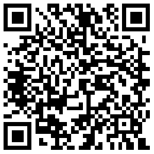

# AI_Learning
This is the Foundation Course of Artificial Intelligence, mainly about python, cv and nlp.
扫描下列二维码进入本网页：       

<p align="center"></p>

# Python3.6.7
- [点击下载Python3.6.7的Windows安装包](https://www.python.org/ftp/python/3.6.7/python-3.6.7-amd64.exe)。更多版本请访问：https://www.python.org/
- [点击下载Github for Windows](https://desktop.github.com/)


# Pytorch安装

```bash
pip3 install https://download.pytorch.org/whl/cu90/torch-1.1.0-cp36-cp36m-win_amd64.whl
```    

```bash
pip3 install https://download.pytorch.org/whl/cu90/torchvision-0.3.0-cp36-cp36m-win_amd64.whl
```

# Pytorch教程
https://pytorch.org/tutorials/    

# 下载上课资料

[1、Torch and Numpy](https://github.com/scutcyr/AI_Learning/blob/master/learn_pytorch/1_torch_numpy.ipynb)[【点击下载】](https://raw.githubusercontent.com/scutcyr/AI_Learning/master/learn_pytorch/1_torch_numpy.ipynb)     
[2、regression.ipynb](https://github.com/scutcyr/AI_Learning/blob/master/learn_pytorch/2_regression.ipynb)[【点击下载】](https://raw.githubusercontent.com/scutcyr/AI_Learning/master/learn_pytorch/2_regression.ipynb)    
[3、CNN.ipynb](https://github.com/scutcyr/AI_Learning/blob/master/learn_pytorch/3_CNN.ipynb)[【点击下载】](https://raw.githubusercontent.com/scutcyr/AI_Learning/master/learn_pytorch/3_CNN.ipynb)

# 下载风格转换代码
[点击下载代码压缩包](https://github.com/scutcyr/AI_Learning/raw/master/style_transform/style_transform.rar)

```python
cnn = models.vgg19()  # 初始化模型
cnn.load_state_dict(torch.load('./checkpoints/vgg19.pth'))  # 下载的模型保存的位置
cnn = cnn.features.to(device).eval()
```
# 下载Python微信聊天代码
[点击下载代码压缩包](https://github.com/scutcyr/AI_Learning/raw/master/python-login-wechat/python-login-wechat.rar)


